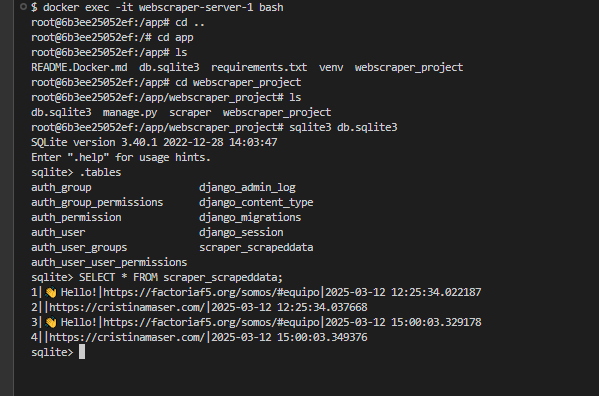

## Web Scraping + Django + Docker

Este repositorio es una práctica de un ejercico de Scraping, basado en la Master Class impartida por [Jorge Bénitez](https://github.com/signados)
.Podeís consultar su paso a paso en [webscraper](https://github.com/Factoria-F5-dev/webscraper) de Factoria F5

Esta realizado con el framework Django y Dockerizado
Mucha consola, mucha fantasía y viajes a mundos muy lejanos🚀

 >  
  [¿Te animas?](https://github.com/Factoria-F5-dev/webscraper)

